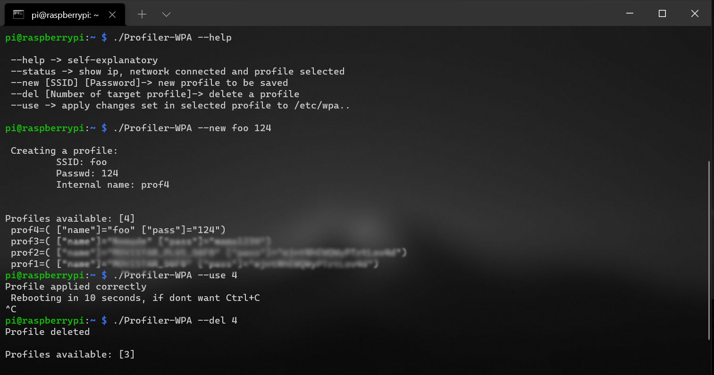

# ***profilerWPA: an easy ***

- Quick Links
    - [Purpose](#purpose)
    - [Security](#security)
    - [Usage](#usage)



# Purpose
It's intended to be used in a RaspberryPi 0W to change easily from stored profiles (AS IT IS!) inside the script itself. 

# Security 
This program stores the password strings as it is, it's one of the first bash programs I made so apologies in advance. 
To avoid any security danger change permissions to only be executed and read by root:
```bash
chown root profilerWPA && chgrp root profilerWPA
chmod 700 ProfilerWPA
```
The file should look like this: 


# Usage
To get a correct use of the script, /etc/wpa_supplicant/wpa_supplicant.conf should look like this
No freespaces or commented lines, just this: 
```bash
ctrl_interface=DIR=/var/run/wpa_supplicant GROUP=netdev
update_config=1
network={
ssid="foo"
psk="123"
}
```
See general information (IP,SSID of the network connected):
```bash
./profilerWPA --status
```
Create a new profile:
```bash
./profilerWPA ----new [SSID] [Password]
```
Delete a profile:
```bash
./profilerWPA --del [Number of the profile]
```
Apply a profile, will reboot unless kill the script:
```bash
./profilerWPA --use [Number of the profile]
```

